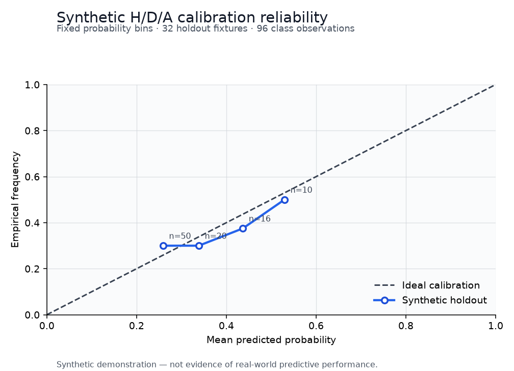

# EPL Probability Forecasting Lab

A reproducible Python project for coherent pre-match football probabilities from a goal model.
The public project is a credential-free, synthetic-first portfolio demonstration.

**Status:** the offline demo is runnable and deterministic. In a separate private historical
evaluation, the candidate was **not promoted** because its precommitted log-loss interval crossed
zero (`[-0.072155, 0.001383]`). The historical-frequency fallback was retained.

| Private historical evaluation | Result |
|---|---:|
| Development matches | 5,700 |
| OOS lockbox matches | 380 |
| Total matches | 6,080 |
| Log loss | 1.046297 |
| Brier score | 0.629821 |
| Accuracy | 0.452632 |
| ECE | 0.043633 |
| Candidate minus historical log loss | -0.035993 |
| Decision | Retain historical-frequency fallback |

These are aggregate results from a private historical evaluation using Football-Data.co.uk source
data. No match-level source data or predictions are distributed, and the public clone cannot
reproduce these exact historical figures.



## Credential-free quickstart

```bash
python -m venv .venv
python -m pip install -e ".[dev]"
python -m epl_probability_lab.demo --output-dir demo
```

No credential is needed. The demo generates 96 fixtures for fictional teams, trains a small
synthetic-only Poisson goal model on the first 64 fixtures, evaluates chronologically on the last 32, and emits
coherent H/D/A probabilities plus a reliability plot. Run `pytest -q`, `ruff check .`, and
`ruff format --check .` for the same local quality gates used by CI.

> Synthetic demonstration — not evidence of real-world predictive performance.

## Three deliberately separate workflows

### Public synthetic demo

The committed demo data and model artifact are generated only from fictional teams and seeded
synthetic scores. Evidence records the seed, configuration, code version, and content hashes.

### Private historical evaluation

Historical model development and an OOS lockbox used 5,700 + 380 = 6,080 matches. Only the compact
aggregate metrics above are published. Source rows, per-match predictions, mappings, manifests,
private hashes, and trained real-data parameters are not included.

### Optional local live-provider workflow

Provider adapters are intentionally outside this public demo. Users who build their own adapter
must supply their own credentials, comply with provider terms, keep downloaded data local, and
provide required attribution. `FOOTBALL_DATA_ORG_TOKEN` is shown empty in `.env.example` and is not
needed for the offline demo.

## Outputs

`python -m epl_probability_lab.demo --output-dir demo` writes:

- `synthetic_fixtures.csv` — 96 fictional, synthetic fixtures;
- `synthetic_model.json` — model parameters fitted only on the synthetic training window;
- `prediction_example.json` — one coherent H/D/A probability example;
- `aggregate_report.json` and `aggregate_report.md` — synthetic holdout metrics;
- `calibration_reliability.png` — synthetic calibration bins and ideal reference;
- `evidence.json` — seed, configuration, code version, counts, and SHA-256 hashes.

See [DATA_RIGHTS.md](DATA_RIGHTS.md), [MODEL_CARD.md](MODEL_CARD.md), and
[docs/data_sources.md](docs/data_sources.md) before using this project with any external data.

## Licence

Original code and documentation are MIT licensed. That software licence does not grant rights to
third-party datasets, APIs, provider services, logos, club marks, or trademarks.
